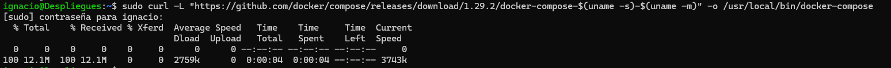
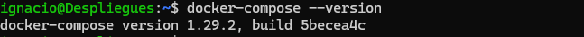
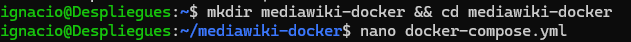
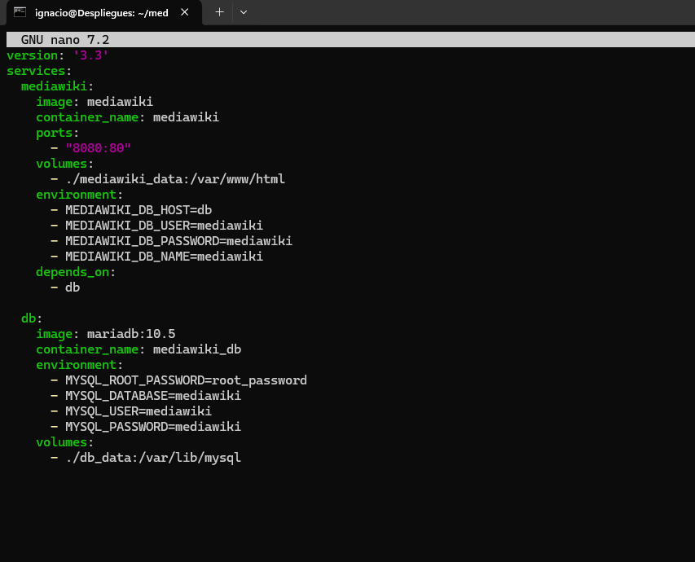
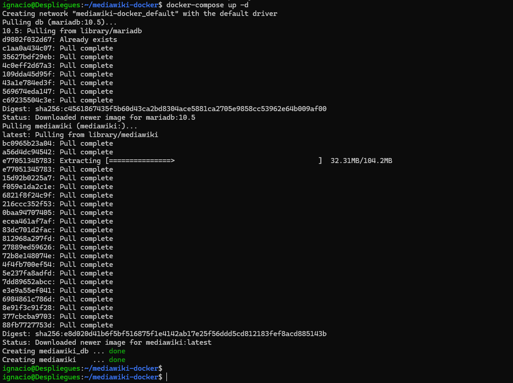

# Instalación y Configuración de MediaWiki con Docker Compose en Debian

## Instalación de Docker Compose


### 1. Instalamos Docker Compose utilizando los siguientes comandos:
```bash
sudo curl -L "https://github.com/docker/compose/releases/download/1.29.2/docker-compose-$(uname -s)-$(uname -m)" -o /usr/local/bin/docker-compose

sudo chmod +x /usr/local/bin/docker-compose
```
Luego verificamos la instalación:
```bash
docker-compose --version
```





### 2. Creamos un directorio para el proyecto y editamos el archivo `docker-compose.yml` con los datos necesarios utilizando `nano`:
```bash
mkdir mediawiki-docker && cd mediawiki-docker
nano docker-compose.yml
```



Agrega el siguiente contenido al archivo:
```yaml
version: '3.3'
services:
  mediawiki:
    image: mediawiki
    container_name: mediawiki
    ports:
      - "8080:80"
    volumes:
      - ./mediawiki_data:/var/www/html
    environment:
      - MEDIAWIKI_DB_HOST=db
      - MEDIAWIKI_DB_USER=mediawiki
      - MEDIAWIKI_DB_PASSWORD=mediawiki
      - MEDIAWIKI_DB_NAME=mediawiki
    depends_on:
      - db

  db:
    image: mariadb:10.5
    container_name: mediawiki_db
    environment:
      - MYSQL_ROOT_PASSWORD=root_password
      - MYSQL_DATABASE=mediawiki
      - MYSQL_USER=mediawiki
      - MYSQL_PASSWORD=mediawiki
    volumes:
      - ./db_data:/var/lib/mysql
```


### 3. Una vez creado el archivo `docker-compose.yml`, levantamos los contenedores con el siguiente comando:
```bash
docker-compose up -d
```




