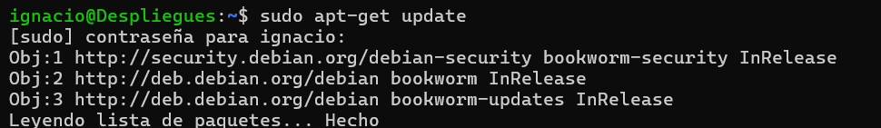
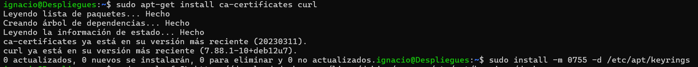
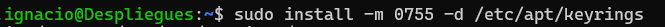
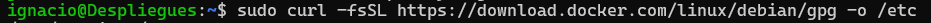
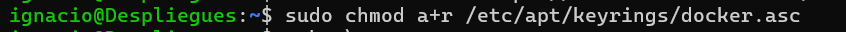
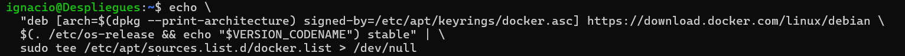
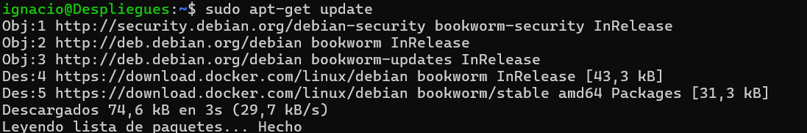
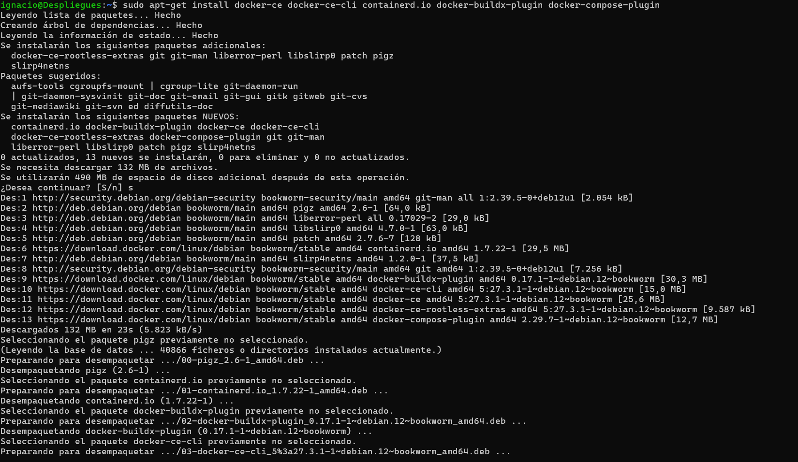
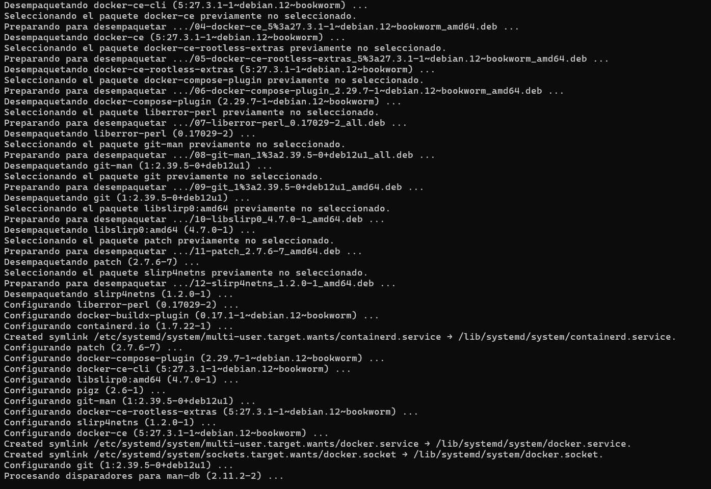
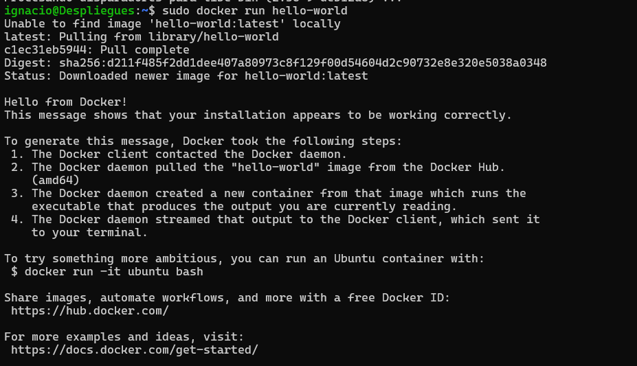

# Instalación de Docker en Debian

Este documento detalla el proceso paso a paso para instalar Docker en Debian.

## 1. Actualización del sistema

Antes de comenzar, actualizamos los repositorios de paquetes.

```bash
sudo apt-get update
```




---

## 2. Instalación de dependencias

Instalamos `ca-certificates` y `curl`, que son necesarios para manejar certificados de seguridad y descargar archivos.

```bash
sudo apt-get install ca-certificates curl
```



---

## 3. Creación del directorio para la clave GPG de Docker

Creamos un directorio en `/etc/apt/keyrings` para almacenar la clave de Docker.

```bash
sudo install -m 0755 -d /etc/apt/keyrings
```

<<<<<<< HEAD

=======

>>>>>>> 8e1cf7a33ba60888e4ad072e188542042d75f008

---

## 4. Descarga de la clave GPG de Docker

Descargamos y guardamos la clave GPG necesaria para verificar los paquetes de Docker.

```bash
sudo curl -fsSL https://download.docker.com/linux/debian/gpg -o /etc/apt/keyrings/docker.asc
```




---

## 5. Configuración de permisos para la clave

Aseguramos que el archivo de la clave GPG sea legible por todos los usuarios.

```bash
sudo chmod a+r /etc/apt/keyrings/docker.asc
```




---

## 6. Adición del repositorio de Docker

Añadimos el repositorio oficial de Docker para Debian.

```bash
echo   "deb [arch=$(dpkg --print-architecture) signed-by=/etc/apt/keyrings/docker.asc] https://download.docker.com/linux/debian   $(. /etc/os-release && echo "$VERSION_CODENAME") stable" |   sudo tee /etc/apt/sources.list.d/docker.list > /dev/null
```



---

## 7. Actualización de la lista de paquetes

Actualizamos la lista de paquetes para incluir los paquetes disponibles desde el repositorio de Docker.

```bash
sudo apt-get update
```



---

## 8. Instalación de Docker

Instalamos Docker y sus componentes necesarios.

```bash
sudo apt-get install docker-ce docker-ce-cli containerd.io docker-buildx-plugin docker-compose-plugin
```





---

## 9. Verificación de la instalación de Docker

Ejecutamos el contenedor de prueba `hello-world` para verificar que Docker se haya instalado correctamente.

```bash
sudo docker run hello-world
```

Si Docker está instalado correctamente, deberías ver un mensaje de bienvenida desde Docker.



---

