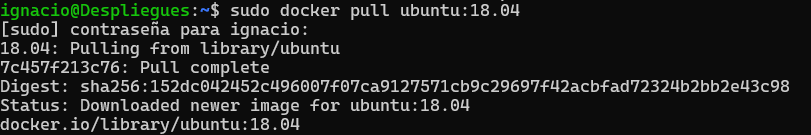
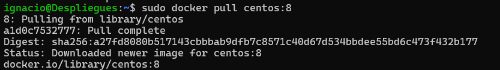
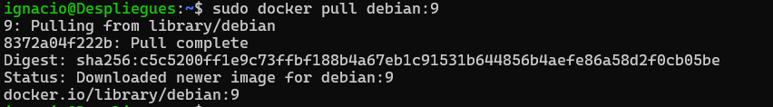
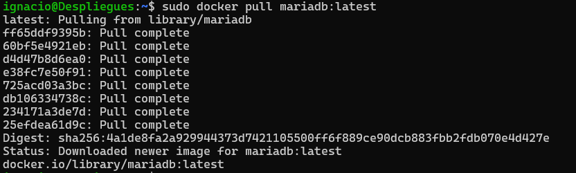
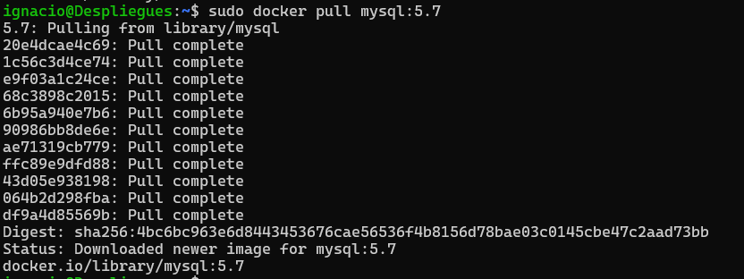
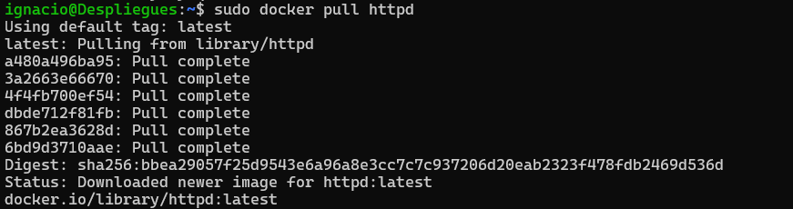
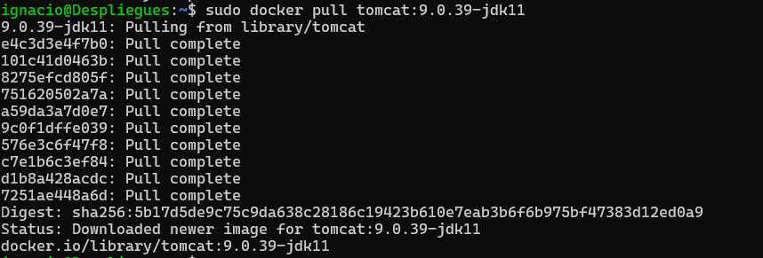
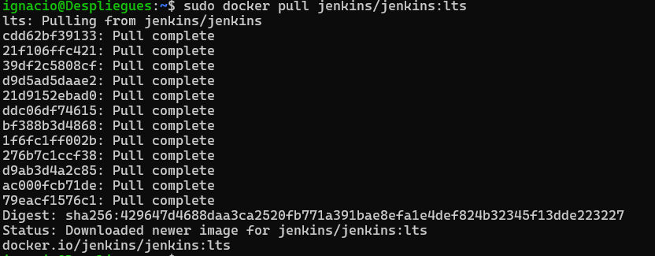
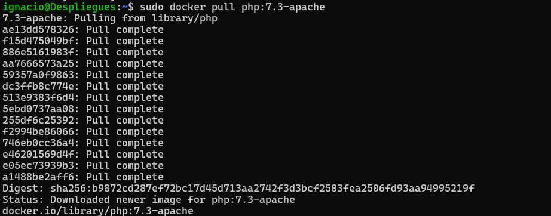

# Informe de Descargas de Imágenes de Docker

Este documento describe los comandos utilizados para descargar varias imágenes de Docker.

## Comandos Ejecutados

1. **Descarga de Ubuntu 18.04 con permisos de superusuario**

   

2. **Descarga de CentOS 8**
 
   

3. **Descarga de Debian 9**

   

4. **Descarga de MariaDB con permisos de superusuario**
   
   

5. **Descarga de MySQL 5.7**
 
   

6. **Descarga de HTTPD**

   

7. **Descarga de Tomcat 9.0.39-jdk11**
 
   

8. **Descarga de Jenkins LTS**
 
   

9. **Descarga de PHP 7.3-apache**
 
   

