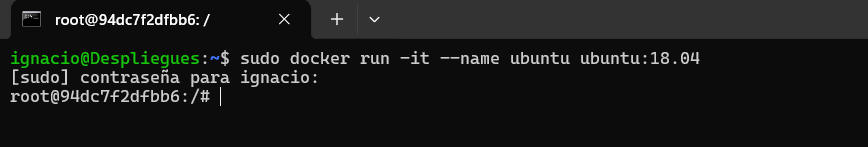
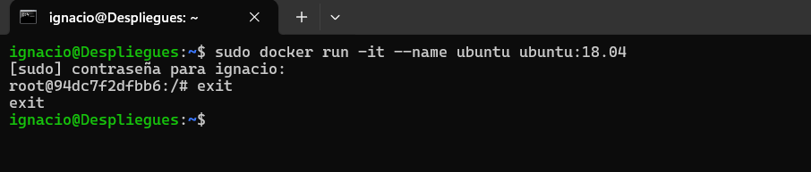
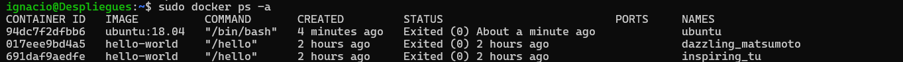
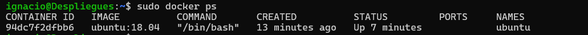
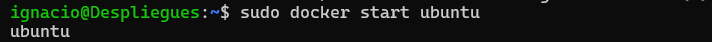
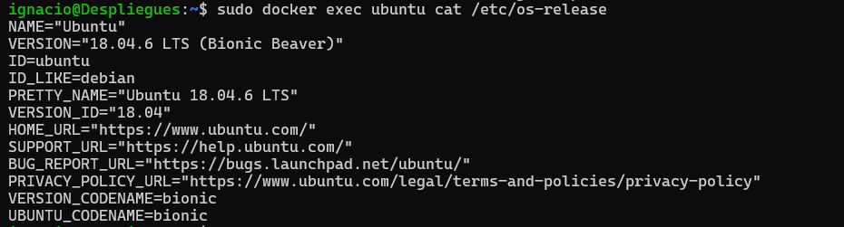

# Documentación de Comandos Docker en Consola

## Comandos Ejecutados

### 1. Creación de un Contenedor Ubuntu

**Descripción:**  
Este comando crea y ejecuta un contenedor Docker usando la imagen `ubuntu:18.04`. Se utiliza el modo interactivo (`-it`) y se asigna el nombre `ubuntu` al contenedor, permitiendo la interacción directa en la terminal del contenedor como usuario root.

### 2. Salida del Contenedor

**Descripción:**  
El comando `exit` finaliza la sesión dentro del contenedor y regresa al sistema host.

### 3. Listado de Contenedores

 

**Descripción:**  
Lista todos los contenedores creados, incluyendo los que están detenidos. 

### 4. Inicio del Contenedor `ubuntu`

 

**Descripción:**  
Inicia el contenedor `ubuntu`, que se encontraba detenido, en segundo plano.

### 5. Verificación de Contenedores Activos

 

**Descripción:**  
Lista los contenedores en ejecución en el sistema, mostrando sólo aquellos que están activos.

### 6. Consulta de la Versión del Sistema Operativo en el Contenedor

**Descripción:**  
Ejecuta el comando `cat /etc/os-release` dentro del contenedor `ubuntu` para verificar la versión de Ubuntu que se está ejecutando en él.

