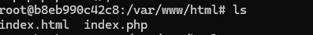

# Ejecución de Servicios desde Contenedores

Este documento describe los pasos realizados para arrancar y configurar dos contenedores en Docker: uno para un servicio web con PHP y Apache, y otro para una base de datos con MariaDB, basado en la salida de la consola de comandos.

## 1. Arranque del contenedor `web` (PHP con Apache)

El primer paso fue arrancar un contenedor con la imagen `php:7.3-apache` para ejecutar un servicio web accesible en el puerto 8181.

### Comando ejecutado:
```bash
sudo docker run -d --name web -p 8181:80 php:7.3-apache
```

Salida:
```bash
b8eb990c42c8bf00ab4d5633103cd99200c6f91dd9df17406a6b9ac78ddbefbc
```


Este comando ejecutó el contenedor con el nombre `web`, mapeando el puerto 80 del contenedor al puerto 8181 en la máquina local.

## 2. Acceso al contenedor `web` y creación de archivos

Se accedió al contenedor para crear los archivos `index.html` e `index.php` en el directorio raíz del servicio web.

### Comando ejecutado:
```bash
sudo docker exec -it web bash
```

Este comando abrió una sesión interactiva de bash dentro del contenedor `web`. A continuación, se crearon los archivos:

### Creación de `index.html`:
```bash
echo "<h1>HOLA SOY IGNACIO NUNEZ</h1>" > index.html
```


### Creación de `index.php`:
```bash
echo "<?php phpinfo(); ?>" > index.php
```


### Verificación de los archivos:
```bash
ls
```

Salida:
```bash
index.html  index.php
```




## 3. Arranque del contenedor `bbdd` (MariaDB)

El siguiente paso fue arrancar un contenedor con la imagen `mariadb` para ejecutar una instancia de MariaDB. Este contenedor fue configurado con las variables de entorno necesarias para crear una base de datos llamada `prueba` y un usuario `invitado` con su respectiva contraseña.

### Comando ejecutado:
```bash
sudo docker run -d --name bbdd -p 3336:3306   -e MYSQL_ROOT_PASSWORD=root   -e MYSQL_DATABASE=prueba   -e MYSQL_USER=invitado   -e MYSQL_PASSWORD=invitado   mariadb
```

Salida:
```bash
f35ed69a2e19a261cdbe12ee06189f4d26419fb3afb23a55ccaf6345ad02937b
```


Este comando ejecutó el contenedor `bbdd`, mapeando el puerto 3306 del contenedor al puerto 3336 en la máquina local.

### Verificación de contenedores en ejecución:
```bash
sudo docker ps
```

Salida:
```bash
CONTAINER ID   IMAGE            COMMAND                  CREATED         STATUS         PORTS                                         NAMES
f35ed69a2e19   mariadb          "docker-entrypoint.s…"   2 minutes ago   Up 2 minutes   0.0.0.0:3336->3306/tcp, [::]:3336->3306/tcp   bbdd
b8eb990c42c8   php:7.3-apache   "docker-php-entrypoi…"   4 minutes ago   Up 4 minutes   0.0.0.0:8181->80/tcp, [::]:8181->80/tcp       web
```


## 4. Comprobación de acceso a los servicios

Para acceder al servicio web, se utilizó el navegador en la URL: `http://localhost:8181`. Sin embargo, al intentar acceder a la base de datos `bbdd`, se debería utilizar el puerto `3336` con las credenciales configuradas (`root` para la contraseña de root, `invitado` para el usuario `invitado`, y `prueba` para la base de datos).

```bash
mysql -h localhost -P 3336 -u invitado -p
```
```bash
mysql -h localhost -P 3336 -u root -p
```

Se accede a la base de datos `prueba` con el usuario y contraseña indicados.


