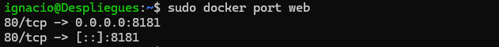
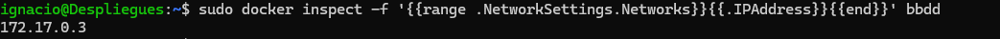
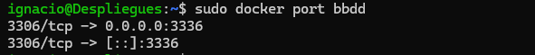

# Obteniendo Información de Contenedores


## 1. Obtener la dirección IP del contenedor `web`

Para obtener la dirección IP del contenedor `web`, se utilizó el siguiente comando:

### Comando ejecutado:
```bash
sudo docker inspect -f '{{range .NetworkSettings.Networks}}{{.IPAddress}}{{end}}' web
```

Salida 
```bash
172.17.0.2
```


## 2. Obtener la redirección de puertos del contenedor `web`

Para obtener la redirección de puertos del contenedor `web`, se utilizó el siguiente comando:

### Comando ejecutado:
```bash
sudo docker port web
```

Salida
```bash
80/tcp -> 0.0.0.0:8181
80/tcp -> [::]:8181
```



## 3. Obtener la dirección IP del contenedor `bbdd`

Para obtener la dirección IP del contenedor `bbdd`, se utilizó el siguiente comando:

### Comando ejecutado:
```bash
sudo docker inspect -f '{{range .NetworkSettings.Networks}}{{.IPAddress}}{{end}}' bbdd
```

Salida
```bash
172.17.0.3
```



## 4. Obtener la redirección de puertos del contenedor `bbdd`

Para obtener la redirección de puertos del contenedor `bbdd`, se utilizó el siguiente comando:

### Comando ejecutado:
```bash
sudo docker port bbdd
```

Salida 
```bash
3306/tcp -> 0.0.0.0:3336
3306/tcp -> [::]:3336
```



