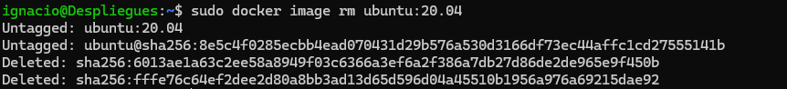

# Gestión de Imágenes en Docker

## Pasos y Comandos

### 1. Descargar la imagen `Ubuntu:20.04` desde Docker Hub
```bash
docker pull ubuntu:20.04
```


### 2. Obtener toda la información de la imagen y volcarla al fichero `info.txt`
```bash
docker image inspect ubuntu:20.04 > info.txt
```


### 3. Instanciar la imagen creando un contenedor llamado `modulo3`
```bash
docker run --name modulo3 -d ubuntu:20.04
```


### 4. Comprobar que el contenedor `modulo3` se ha creado (en ejecución o no)
```bash
docker ps -a
```


### 5. Intentar borrar la imagen `Ubuntu:20.04`
```bash
docker image rm ubuntu:20.04
```


- **Respuesta**: No se puede borrar la imagen porque está siendo utilizada por el contenedor `modulo3`, incluso si el contenedor está detenido.

### 6. Realizar las operaciones necesarias para poder borrar la imagen

#### a) Detener el contenedor (si está en ejecución)
```bash
docker stop modulo3
```


#### b) Eliminar el contenedor
```bash
docker rm modulo3
```


#### c) Borrar la imagen
```bash
docker image rm ubuntu:20.04
```


### Verificación final
Comprobar que la imagen ha sido eliminada:
```bash
docker images
```

