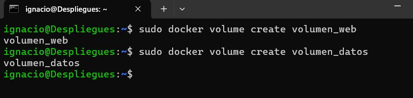
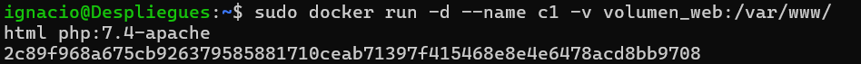
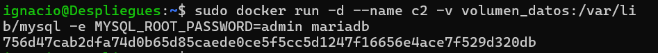
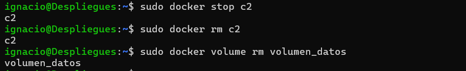

# Ejercicio de Docker: Volúmenes y Persistencia de Datos en Debian 12

Configuraremos volúmenes en Docker y los utilizaremos para la persistencia de datos en contenedores de PHP/Apache y MariaDB.


## Pasos del ejercicio

### 1. Crear volúmenes

Primero, crea los volúmenes necesarios para el ejercicio.

**Comando:**
```bash
docker volume create volumen_datos
docker volume create volumen_web
```



### 2. Crear y ejecutar contenedores

#### Contenedor `c1` con PHP y Apache

Arranca un contenedor llamado `c1` usando la imagen `php:7.4-apache`, montando el volumen `volumen_web` en la ruta `/var/www/html`:

**Comando:**
```bash
docker run -d --name c1 -v volumen_web:/var/www/html php:7.4-apache
```




#### Contenedor `c2` con MariaDB

Arranca un contenedor llamado `c2` usando la imagen `mariadb`, montando el volumen `volumen_datos` en la ruta `/var/lib/mysql` y configurando la contraseña de root como `admin`:

**Comando:**
```bash
docker run -d --name c2 -v volumen_datos:/var/lib/mysql -e MYSQL_ROOT_PASSWORD=admin mariadb
```




### 3. Parar y eliminar el contenedor `c2`, luego eliminar el volumen `volumen_datos`

Para detener y eliminar el contenedor `c2`, ejecuta:

**Comandos:**
```bash
docker stop c2
docker rm c2
```

Después, elimina el volumen `volumen_datos`:

```bash
docker volume rm volumen_datos
```




---

