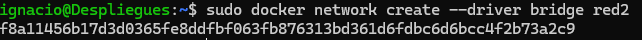
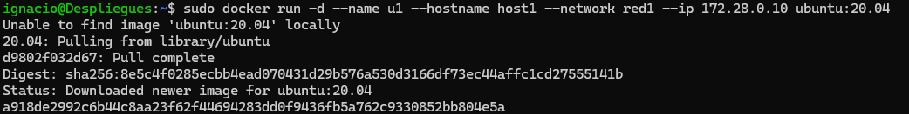
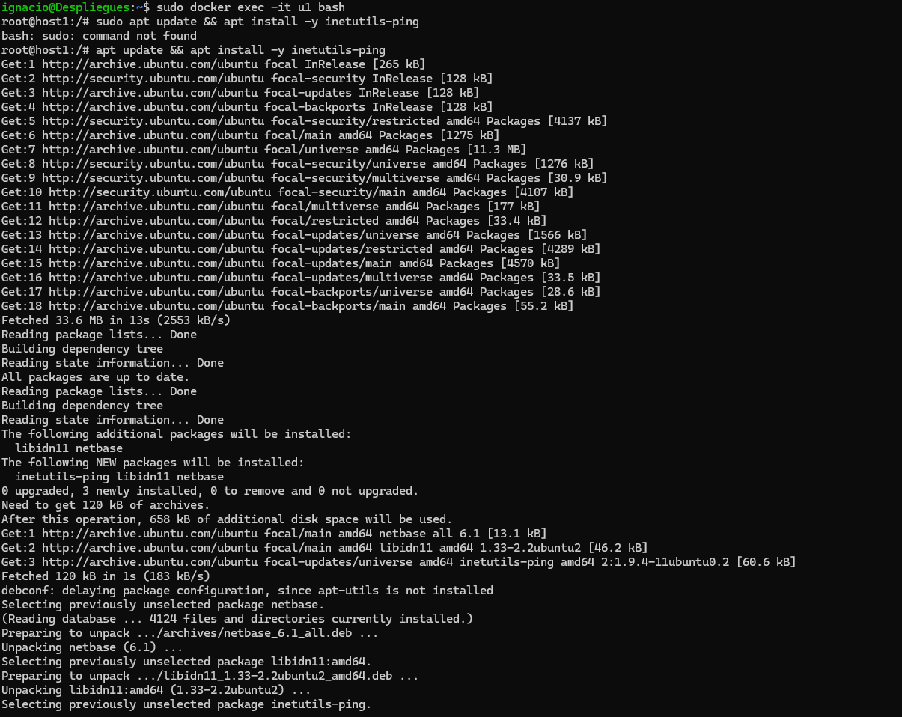
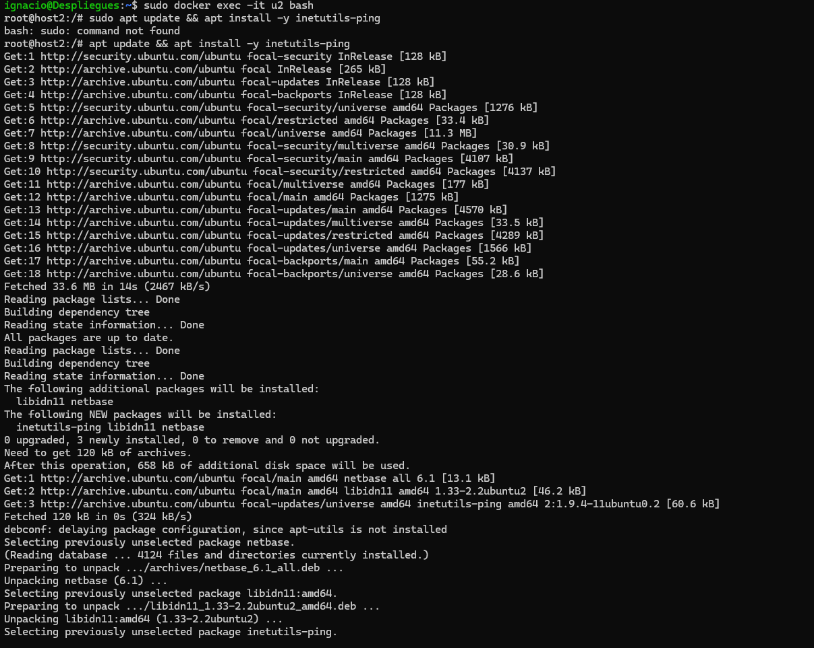

# Ejercicio de Docker: Configuración de Redes en Debian 12

En este ejercicio, configuraremos dos redes de tipo BRIDGE en Docker y añadiremos contenedores de Ubuntu conectados a cada red para comprobar la comunicación entre ellos.


---

## Pasos del ejercicio

### 1. Crear Redes de Tipo BRIDGE

#### Red1

Crea una red llamada `red1` con la dirección IP `172.28.0.0/16` y un gateway `172.28.0.1`.

**Comando:**
```bash
docker network create --driver bridge --subnet 172.28.0.0/16 --gateway 172.28.0.1 red1
```


#### Red2

Crea una red llamada `red2`, donde Docker asignará automáticamente la configuración de red.

**Comando:**
```bash
docker network create --driver bridge red2
```



### 2. Ejecutar Contenedores

#### Contenedor `u1` en Red1

Inicia un contenedor llamado `u1` usando la imagen `ubuntu:20.04`, asignando el hostname `host1`, la IP `172.28.0.10`, y con conexión a la red `red1`:

**Comando:**
```bash
docker run -d --name u1 --hostname host1 --network red1 --ip 172.28.0.10 ubuntu:20.04 tail -f /dev/null
```



Después, entra al contenedor `u1` y actualiza los repositorios para instalar la herramienta `ping`:

**Comando:**
```bash
docker exec -it u1 bash
apt update && apt install -y inetutils-ping
```



#### Contenedor `u2` en Red2

Inicia un contenedor llamado `u2` usando la imagen `ubuntu:20.04`, asignando el hostname `host2` y conectándolo a la red `red2` (Docker asignará automáticamente la IP):

**Comando:**
```bash
docker run -d --name u2 --hostname host2 --network red2 ubuntu:20.04 tail -f /dev/null
```


Después, entra al contenedor `u2` e instala la herramienta `ping`:

**Comando:**
```bash
docker exec -it u2 bash
apt update && apt install -y inetutils-ping
```



### 3. Verificar la Conectividad entre `u1` y `u2`

Comprueba que ambos contenedores se pueden ver entre ellos. Entra en `u1` y haz un ping a `host2`, luego entra en `u2` y haz un ping a `host1` para confirmar la comunicación.

**Comandos para ping desde `u1` a `host2`:**
```bash
docker exec -it u1 ping host2
```

**Comandos para ping desde `u2` a `host1`:**
```bash
docker exec -it u2 ping host1
```


---


